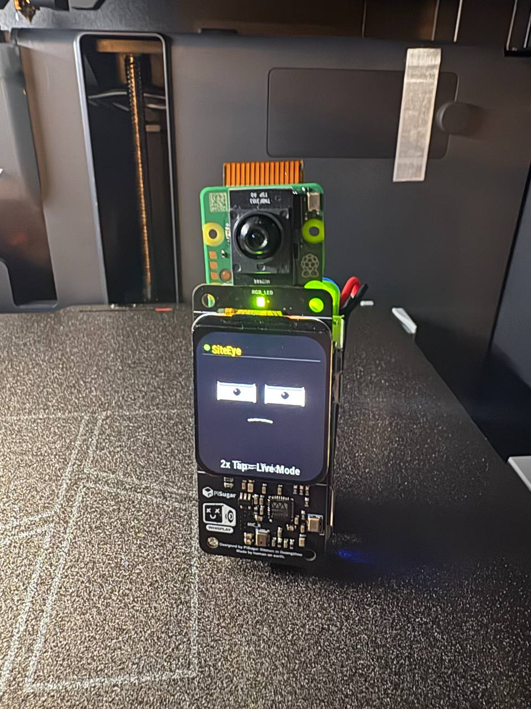
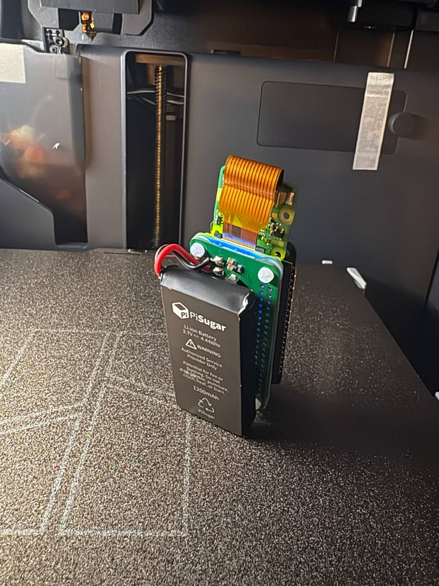

# SiteEye — Wearable AI Field Assistant

A wearable AI device that sees, hears, and speaks. Built on Raspberry Pi Zero 2W with LCD face, camera, mic, and speaker. Press a button to talk to your AI, hold it to analyze what you see.

Designed for construction jobsites — hands-free AI that clips to your vest.

<p align="center">
  
  
</p>

---

## Features

- **Voice AI** — Tap the button, ask anything. Whisper STT → AI → TTS through the speaker.
- **Camera Vision** — Hold the button, snap a photo. GPT-4o analyzes what you see and speaks the answer.
- **Animated LCD Face** — Cozmo-style eyes with blinks, saccades, and expressions. Reacts to state changes.
- **Info Dashboard** — Double-tap to cycle through BTC price, calendar, weather, and device stats.
- **Telegram Mirror** — Every interaction is mirrored to your phone via Telegram bot.

## Hardware

| Part | Component | Link | ~Price |
|------|-----------|------|--------|
| Computer | Raspberry Pi Zero 2W | [Amazon](https://www.amazon.com/dp/B0FWRPF4FV) | $24 |
| HAT | Whisplay HAT for Pi Zero | [Amazon](https://www.amazon.com/dp/B0FPG8S6K6) | $30 |
| Camera | Raspberry Pi AI Camera (IMX500) | [Amazon](https://www.amazon.com/dp/B0DJ8VFWKM) | $70 |
| Battery | PiSugar S Plus (1200mAh) | [Amazon](https://www.amazon.com/dp/B0FB3N1YSK) | $40 |
| Case | 3D printed | See `case-design/` | — |

**Total BOM: ~$164**

> **Note:** A standard [Pi Camera Module 3](https://www.amazon.com/dp/B0BRY6MVXL) (~$54) works as a drop-in replacement if you don't need on-device AI inference. All vision processing is cloud-based.

The Whisplay HAT provides the LCD display (1.69" IPS, 240×280, ST7789), WM8960 audio codec (dual MEMS mics + speaker amp), RGB LED, and a programmable button — all in one board.

## Architecture

```
┌──────────────────────┐     HTTPS      ┌──────────────────────┐
│  Pi Zero 2W          │ ◄────────────► │  Proxy Server (VPS)  │
│                      │                │                      │
│  main.py             │                │  server.py           │
│  ├─ Button input     │                │  ├─ /voice_all       │
│  ├─ Audio record     │  audio+image   │  │  ├─ Whisper STT   │
│  ├─ Camera capture   │ ──────────────►│  │  ├─ AI chat       │
│  ├─ LCD face         │                │  │  └─ TTS           │
│  └─ Speaker playback │◄──────────────│  ├─ /vision_tts      │
│                      │  text+audio    │  ├─ /dashboard       │
│  lcd_ui.py           │                │  └─ /health          │
│  └─ Animated eyes    │                │                      │
└──────────────────────┘                └──────────────────────┘
```

## Controls

| Action | Input | Result |
|--------|-------|--------|
| **Voice** | Tap button | Record → AI → Speak response |
| **Camera** | Hold button (>1s) | Snap → Vision analysis → Speak |
| **Dashboard** | Double-tap | Cycle: BTC → Calendar → Weather → Device |
| **Stop** | Tap during recording | Stop recording, send to AI |

## Setup

### 1. Pi Client

```bash
# Clone to Pi
git clone https://github.com/mjamiv/SiteEye.git ~/siteeye
cd ~/siteeye

# Install dependencies
pip install requests pillow

# Configure
cp .env.example ~/.env
nano ~/.env  # Fill in SITEEYE_PROXY, TELEGRAM_BOT_TOKEN, TELEGRAM_CHAT_ID

# Install service
chmod +x setup-service.sh
./setup-service.sh

# Start
sudo systemctl start siteeye
```

### 2. Proxy Server

```bash
# On your VPS
cd server/
pip install flask openai requests

# Configure
cp .env.server.example .env
nano .env  # Fill in OPENAI_API_KEY, OPENCLAW_URL, OPENCLAW_TOKEN, GOOGLE_API_KEY

# Run
python3 server.py
```

### Environment Variables

**Pi Client** (`.env`):
| Variable | Required | Description |
|----------|----------|-------------|
| `SITEEYE_PROXY` | Yes | URL of your proxy server |
| `TELEGRAM_BOT_TOKEN` | No | Telegram bot token for mirroring |
| `TELEGRAM_CHAT_ID` | No | Telegram chat ID to mirror to |

**Proxy Server** (`.env`):
| Variable | Required | Description |
|----------|----------|-------------|
| `OPENAI_API_KEY` | Yes | OpenAI API key (Whisper + TTS + Vision) |
| `OPENCLAW_URL` | No | OpenClaw gateway URL for AI chat |
| `OPENCLAW_TOKEN` | No | OpenClaw auth token |
| `GOOGLE_API_KEY` | No | Google API key (for dashboard data) |

## LCD States

The animated face reflects device state:

- **Idle** — Relaxed eyes with random blinks and saccades
- **Listening** — Wide eyes, raised brows, audio level bars
- **Thinking** — Squinted eyes looking up, animated dots
- **Speaking** — Relaxed eyes, mouth animation, waveform pulse
- **Camera** — Viewfinder overlay with crosshair
- **Dashboard** — Info panels with page indicator dots

## Project Structure

```
├── main.py              # Pi client — button handling, voice/camera flows
├── lcd_ui.py            # LCD display — animated face, dashboard panels
├── server.py            # Proxy server — STT, AI, TTS, vision, dashboard API
├── siteeye.service      # systemd service file
├── setup-service.sh     # Service installer
├── .env.example         # Pi environment template
├── .env.server.example  # Server environment template
├── assets/              # Audio feedback files (chime, click, etc.)
├── hardware/            # Wiring diagrams and pin references
├── case-design/         # 3D printable case files
├── build-photos/        # Build documentation photos
└── archive/             # Previous versions (v1-v7, OLED, etc.)
```

## Build Photos

See `build-photos/` for the full build journey.

## License

MIT

## Credits

Built by [Michael Martello](https://github.com/mjamiv) and [Molt](https://github.com/mjamiv/SiteEye) — a bridge engineer and his AI, proving that a single engineer with a laptop can build anything.
